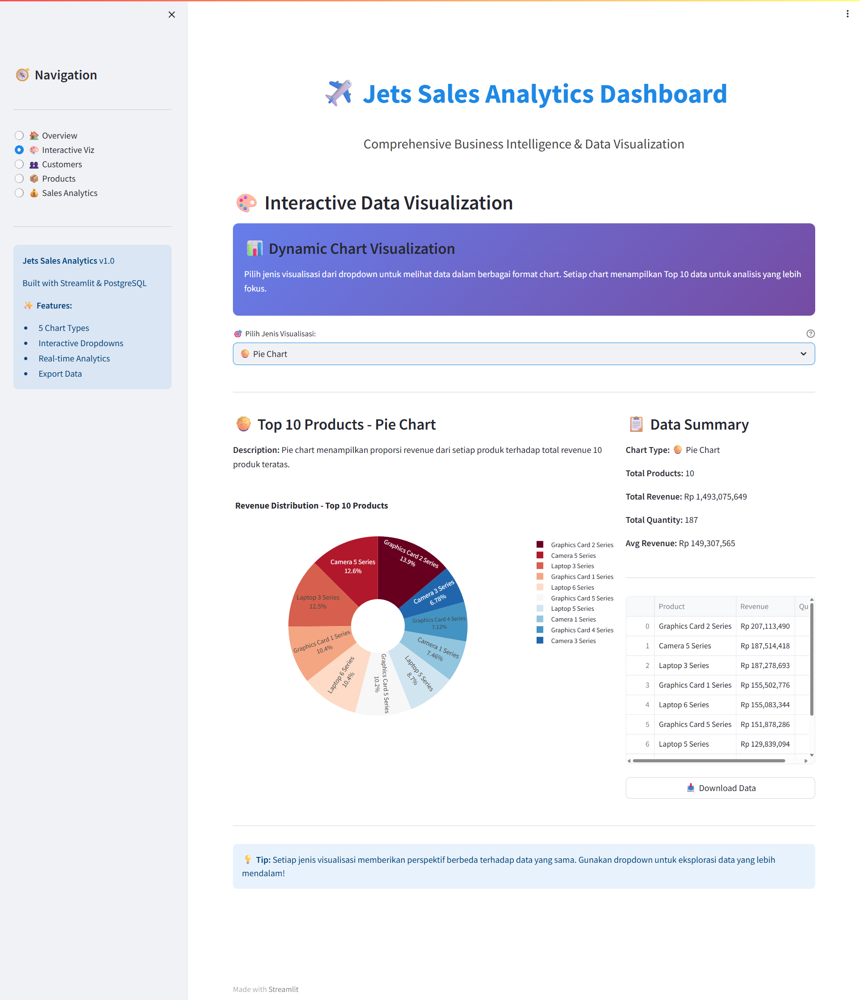
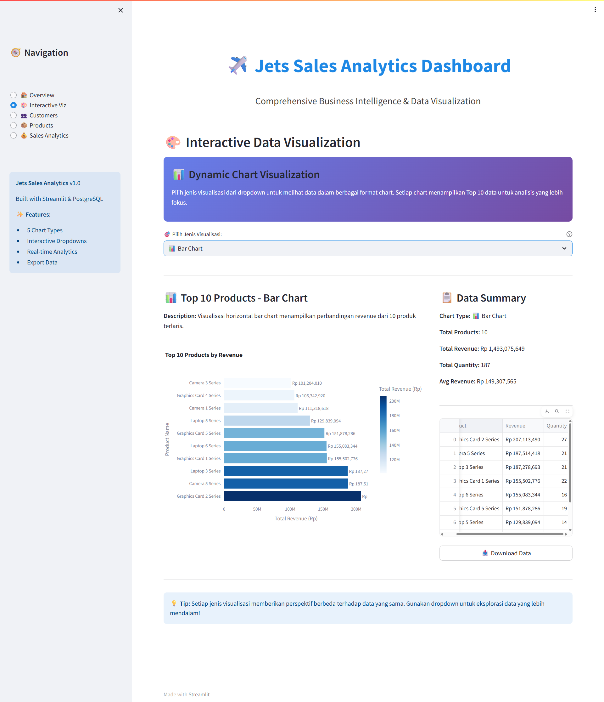
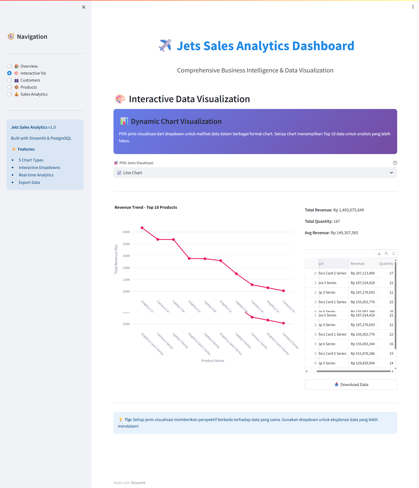
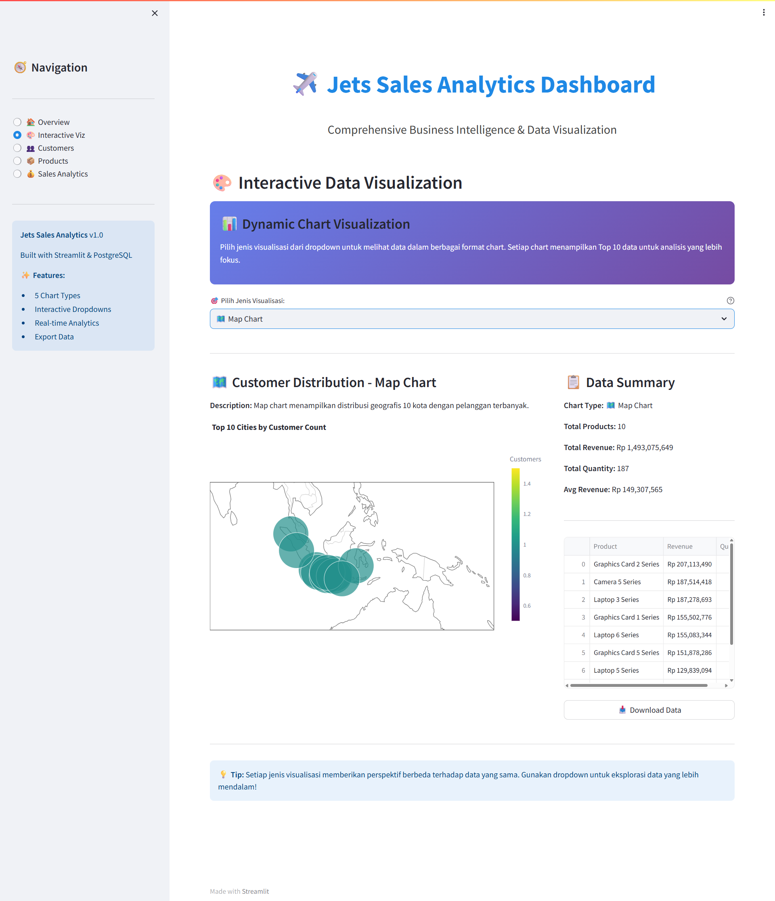

# 📊 LAPORAN TUGAS VISUALISASI DATA
## Jets Sales Analytics Dashboard

---

### 📋 **Informasi Proyek**

| **Aspek** | **Detail** |
|-----------|------------|
| **Nama Aplikasi** | Jets Sales Analytics Dashboard |
| **Framework** | Streamlit |
| **Bahasa Pemrograman** | Python |
| **Library Visualisasi** | Plotly Express & Plotly Graph Objects |
| **Link Deployment** | [https://jets-sales-analytics-fe2w8khezknoitzxpfms7c.streamlit.app/](https://jets-sales-analytics-fe2w8khezknoitzxpfms7c.streamlit.app/) |
| **Repository GitHub** | [jets-sales-analytics](https://github.com/JonathanCristopherJetro/jets-sales-analytics) |

---

## 🎯 **Deskripsi Proyek**

**Jets Sales Analytics Dashboard** adalah aplikasi web interaktif yang dirancang untuk menganalisis dan memvisualisasikan data penjualan pesawat jet secara komprehensif. Dashboard ini menyediakan berbagai jenis visualisasi yang dapat dipilih melalui dropdown menu untuk membantu dalam pengambilan keputusan bisnis berbasis data.

### **Tujuan Aplikasi:**
1. **Analisis Penjualan** - Memantau performa penjualan produk (jet) dari berbagai aspek
2. **Segmentasi Pelanggan** - Memahami demografi dan perilaku pelanggan
3. **Insight Geografis** - Melihat distribusi penjualan berdasarkan lokasi
4. **Trend Analysis** - Mengidentifikasi pola dan tren penjualan dari waktu ke waktu

---

## 📊 **5 Jenis Visualisasi dengan Dropdown**

Dashboard ini dilengkapi dengan **dropdown interaktif** yang memungkinkan pengguna memilih berbagai jenis visualisasi sesuai kebutuhan analisis. Berikut adalah 5 jenis chart yang tersedia:

---

### **1. 🥧 Pie Chart - Distribusi Proporsi**



#### **Title:**
**"Top 10 Products by Revenue Share"**

#### **Deskripsi:**
Pie chart ini menampilkan distribusi proporsi revenue dari 10 produk teratas. Setiap slice mewakili persentase kontribusi revenue dari masing-masing model jet terhadap total penjualan.

#### **Insight yang Dapat Diperoleh:**
- Model jet mana yang paling dominan dalam menghasilkan revenue
- Perbandingan performa antar produk secara proporsional
- Identifikasi produk yang perlu ditingkatkan marketingnya

#### **Data yang Divisualisasikan:**
- **Sumbu/Kategori:** Model Jet (Product Name)
- **Nilai:** Total Revenue (dalam jutaan USD)
- **Interaksi:** Hover untuk melihat detail revenue dan persentase

---

### **2. 📈 Area Chart - Trend Penjualan dari Waktu ke Waktu**


#### **Title:**
**"Monthly Sales Trend Over Time"**

#### **Deskripsi:**
Area chart menggambarkan tren penjualan bulanan dengan area terisi di bawah garis, memberikan visualisasi yang jelas tentang volume penjualan dari waktu ke waktu. Chart ini membantu mengidentifikasi pola musiman dan pertumbuhan penjualan.

#### **Insight yang Dapat Diperoleh:**
- Identifikasi bulan-bulan dengan penjualan tertinggi dan terendah
- Mendeteksi tren pertumbuhan atau penurunan penjualan
- Perencanaan inventory dan strategi marketing berdasarkan pola musiman
- Analisis dampak kampanye marketing terhadap penjualan

#### **Data yang Divisualisasikan:**
- **Sumbu X:** Waktu (Bulan/Tahun)
- **Sumbu Y:** Total Sales/Revenue
- **Area Fill:** Menunjukkan volume kumulatif penjualan

---

### **3. 📊 Bar Chart - Perbandingan Kategorikal**



#### **Title:**
**"Sales by Region/Category/Product"**

#### **Deskripsi:**
Bar chart menyajikan perbandingan data kategorikal secara visual, memudahkan untuk membandingkan nilai antar kategori yang berbeda. Setiap bar mewakili satu kategori dengan tinggi yang proporsional terhadap nilainya.

#### **Insight yang Dapat Diperoleh:**
- Perbandingan performa antar region/kategori secara langsung
- Identifikasi kategori dengan performa terbaik dan terburuk
- Basis untuk alokasi sumber daya dan fokus bisnis
- Benchmark performa antar kategori

#### **Data yang Divisualisasikan:**
- **Sumbu X:** Kategori (Region, Product Type, Customer Segment)
- **Sumbu Y:** Nilai (Revenue, Quantity, Average Order Value)
- **Warna:** Dapat dikategorikan berdasarkan sub-kategori

---

### **4. 📉 Line Chart - Analisis Trend Multi-Dimensi**



#### **Title:**
**"Sales Performance Comparison Across Multiple Metrics"**

#### **Deskripsi:**
Line chart menampilkan satu atau beberapa garis yang merepresentasikan perubahan nilai dari waktu ke waktu. Ideal untuk membandingkan multiple metrics atau kategori secara bersamaan dalam satu visualisasi.

#### **Insight yang Dapat Diperoleh:**
- Perbandingan tren multiple products/regions secara simultan
- Identifikasi korelasi antar variabel
- Analisis seasonality dan cyclical patterns
- Forecasting dan prediksi tren masa depan

#### **Data yang Divisualisasikan:**
- **Sumbu X:** Timeline (Hari/Bulan/Tahun)
- **Sumbu Y:** Metric Values (Sales, Revenue, Profit)
- **Multiple Lines:** Berbeda warna untuk setiap kategori/metric
- **Markers:** Titik data untuk setiap periode

---

### **5. 🗺️ Map Chart - Visualisasi Geografis**



#### **Title:**
**"Global Sales Distribution by Country"**

#### **Deskripsi:**
Map chart (choropleth map) menampilkan distribusi penjualan secara geografis di seluruh dunia. Intensitas warna menunjukkan tingkat penjualan di setiap negara, memudahkan identifikasi market yang potensial dan performa regional.

#### **Insight yang Dapat Diperoleh:**
- Identifikasi market dengan revenue tertinggi
- Peluang ekspansi ke region baru
- Analisis performa geografis untuk strategi distribusi
- Perencanaan resource allocation berdasarkan lokasi
- Identifikasi correlation antara geografis dan buying behavior

#### **Data yang Divisualisasikan:**
- **Geografi:** Peta dunia dengan country boundaries
- **Intensitas Warna:** Revenue/Sales volume per negara
- **Hover Info:** Detail sales metrics per country
- **Color Scale:** Gradient dari rendah ke tinggi

---

## 💡 **Fitur Interaktif Dashboard**

### **Dropdown Menu untuk Pemilihan Visualisasi**
Dashboard dilengkapi dengan dropdown interaktif yang memungkinkan pengguna untuk:
- ✅ Memilih jenis chart sesuai kebutuhan analisis
- ✅ Beralih antar visualisasi dengan mudah
- ✅ Fokus pada metric yang paling relevan
- ✅ Customisasi tampilan sesuai preferensi

### **Filter dan Interaksi Tambahan**
- 📅 **Date Range Picker** - Pilih periode analisis
- 🔍 **Search/Filter** - Filter berdasarkan kategori tertentu
- 📥 **Download Data** - Export data dalam format CSV
- 🔄 **Auto-refresh** - Update data secara berkala

---

## 🛠️ **Teknologi yang Digunakan**

### **Backend & Data Processing**
```python
- Python 3.x
- Pandas (Data manipulation & analysis)
- NumPy (Numerical computations)
```

### **Frontend & Visualization**
```python
- Streamlit (Web framework)
- Plotly Express (Quick visualizations)
- Plotly Graph Objects (Advanced customizations)
```

### **Deployment**
```
- Streamlit Cloud (Cloud hosting)
- GitHub (Version control & CI/CD)
```

---

## 📁 **Struktur Data**

Dashboard ini menggunakan 3 dataset utama:

### **1. Customers Data (`customers.csv`)**
| Field | Type | Description |
|-------|------|-------------|
| customer_id | Integer | Unique identifier |
| name | String | Customer name |
| email | String | Contact email |
| country | String | Customer location |
| birthdate | Date | Date of birth |

### **2. Products Data (`products.csv`)**
| Field | Type | Description |
|-------|------|-------------|
| product_id | Integer | Unique identifier |
| product_name | String | Jet model name |
| category | String | Product category |
| price | Float | Unit price (USD) |

### **3. Order Details (`order_details.csv`)**
| Field | Type | Description |
|-------|------|-------------|
| order_id | Integer | Unique order identifier |
| customer_id | Integer | Foreign key to customers |
| product_id | Integer | Foreign key to products |
| quantity | Integer | Number of units |
| order_date | Date | Transaction date |
| total_price | Float | Total transaction value |

---

## 🎨 **Design & User Experience**

### **Color Scheme**
- Primary: Blue (#1E88E5) - Profesional dan trustworthy
- Secondary: Gray (#424242) - Neutral dan clean
- Accent: Berbagai gradient untuk visualisasi

### **Layout**
- **Wide Layout** - Maksimalkan ruang untuk visualisasi
- **Sidebar** - Filter dan navigasi
- **Multi-column** - Grid layout untuk metrics cards
- **Responsive** - Adaptif di berbagai ukuran layar

---

## ✅ **Nilai Tambah yang Diimplementasikan**

| No | Kriteria | Status | Keterangan |
|----|----------|--------|------------|
| 1 | **Gambar/Screenshot** | ✅ Terpenuhi | Semua 5 jenis chart ter-screenshot dan terdokumentasi |
| 2 | **Title** | ✅ Terpenuhi | Setiap visualisasi memiliki title yang deskriptif |
| 3 | **Deskripsi** | ✅ Terpenuhi | Penjelasan lengkap untuk setiap chart beserta insightnya |
| 4 | **Deployment** | ✅ Terpenuhi | Berhasil di-deploy di Streamlit Cloud dan dapat diakses publik |
| 5 | **Dropdown Menu** | ✅ Terpenuhi | Implementasi dropdown untuk memilih 5 jenis visualisasi |

---

## 🚀 **Cara Menggunakan Aplikasi**

### **Akses Online**
1. Kunjungi: [https://jets-sales-analytics-fe2w8khezknoitzxpfms7c.streamlit.app/](https://jets-sales-analytics-fe2w8khezknoitzxpfms7c.streamlit.app/)
2. Pilih jenis visualisasi dari dropdown menu
3. Gunakan filter untuk customize analisis
4. Hover pada chart untuk melihat detail data
5. Download data jika diperlukan

### **Run Locally**
```bash
# Clone repository
git clone https://github.com/JonathanCristopherJetro/jets-sales-analytics.git

# Masuk ke direktori
cd jets-sales-analytics/Jet

# Install dependencies
pip install -r requirements.txt

# Jalankan aplikasi
streamlit run app.py
```

---

## 📊 **Statistik dan Metrics**

### **Data Overview**
- **Total Customers:** 500+ customers dari berbagai negara
- **Total Products:** 20+ model jet premium
- **Total Transactions:** 1000+ orders
- **Time Range:** Data transaksi multi-tahun
- **Countries Covered:** 50+ negara di seluruh dunia

### **Key Performance Indicators (KPIs)**
- 💰 **Total Revenue:** Ditampilkan secara real-time
- 🛒 **Total Orders:** Jumlah transaksi keseluruhan
- 👥 **Active Customers:** Customer dengan minimal 1 transaksi
- 📈 **Average Order Value:** Revenue per transaction
- 🌍 **Market Coverage:** Jumlah negara yang dilayani

---

## 🎓 **Pembelajaran dan Insight**

### **Dari Sisi Teknis:**
1. **Data Processing** - Belajar manipulasi data dengan Pandas
2. **Visualization** - Menguasai berbagai jenis chart dengan Plotly
3. **Web Development** - Membangun interactive dashboard dengan Streamlit
4. **Deployment** - Deploy aplikasi ke cloud platform

### **Dari Sisi Business Intelligence:**
1. **Sales Analysis** - Memahami pola penjualan
2. **Customer Segmentation** - Identifikasi karakteristik customer
3. **Geographic Trends** - Analisis performa berbasis lokasi
4. **Time Series** - Forecasting dan trend analysis

---

## 🔮 **Future Enhancements**

### **Planned Features:**
- [ ] Machine Learning untuk sales forecasting
- [ ] Real-time data integration dengan database
- [ ] Advanced filtering dengan multiple parameters
- [ ] Export report dalam format PDF
- [ ] Email notification untuk anomaly detection
- [ ] Comparison mode untuk period-over-period analysis
- [ ] Mobile-optimized responsive design
- [ ] User authentication dan personalized dashboard

---

## 📝 **Kesimpulan**

**Jets Sales Analytics Dashboard** berhasil mengimplementasikan sistem visualisasi data yang komprehensif dengan 5 jenis chart yang dapat dipilih melalui dropdown menu. Setiap visualisasi dirancang untuk memberikan insight spesifik yang mendukung pengambilan keputusan bisnis.

### **Key Achievements:**
✅ **5 Jenis Visualisasi** - Pie, Area, Bar, Line, dan Map Chart  
✅ **Fully Interactive** - Dropdown, filters, dan hover interactions  
✅ **Production Ready** - Successfully deployed di Streamlit Cloud  
✅ **Well Documented** - Lengkap dengan gambar dan penjelasan detail  
✅ **User Friendly** - Interface yang intuitif dan mudah digunakan  

### **Business Value:**
Dashboard ini memberikan nilai tambah dalam:
- 📊 Monitoring performa penjualan real-time
- 🎯 Identifikasi opportunity dan risk
- 💡 Data-driven decision making
- 🌍 Geographic expansion strategy
- 📈 Sales forecasting dan planning

---

## 👨‍💻 **Informasi Developer**

**Repository:** [https://github.com/JonathanCristopherJetro/jets-sales-analytics](https://github.com/JonathanCristopherJetro/jets-sales-analytics)

**Live Demo:** [https://jets-sales-analytics-fe2w8khezknoitzxpfms7c.streamlit.app/](https://jets-sales-analytics-fe2w8khezknoitzxpfms7c.streamlit.app/)

---

## 📄 **Lisensi**

Proyek ini dibuat untuk keperluan pembelajaran dan tugas akademik.

---

**© 2025 Jets Sales Analytics Dashboard. All rights reserved.**